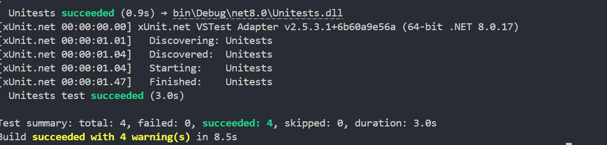

## Template.Unitests
This folder contains unit tests for the API services, ensuring code quality and reliability through automated testing.

## Tests run
```
cd Template.Unitests
dotnet test
```

Test result:<br>
